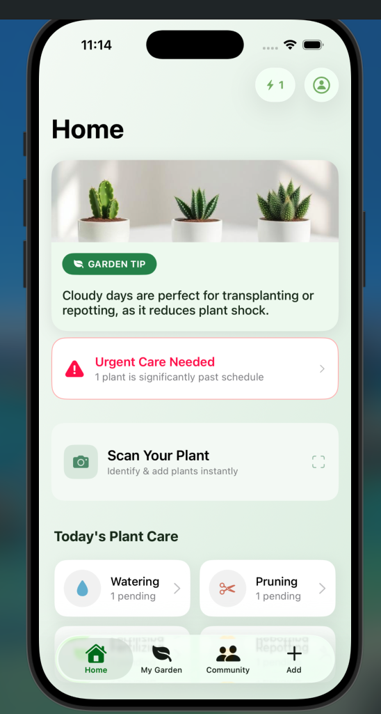
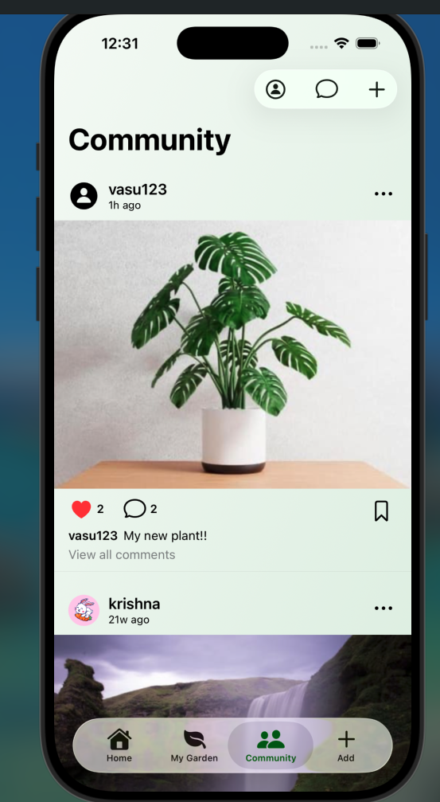
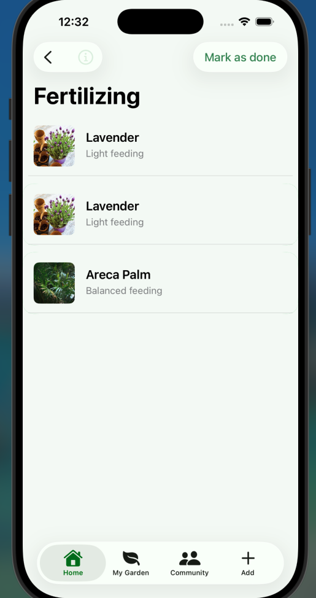
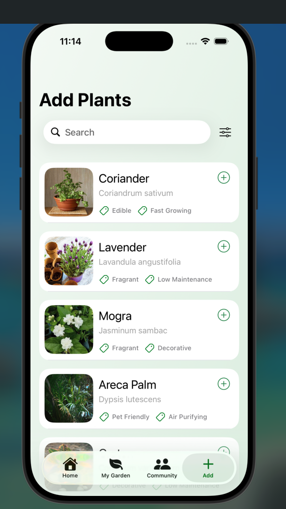

# Leafora — Backend

Node.js/Express backend powering **Leafora**, an iOS plant care app with AR plant visualization, real-time messaging, and community features.

📱 **iOS Frontend Repo:** [New-Leafora](https://github.com/vedantarya22/New-Leafora)
🎥 **Demo Video:** [Google Drive Link](https://drive.google.com/file/d/1UF9qnF0tDAf0xEs3vRYrnkJOAWbgtYly/view?usp=sharing)

---

## Screenshots

| Home | Community|
|------|---------|
|  |  |

| Task Overview | Plants Page |
|---------------|------|
|  | 

---

## Tech Stack

- **Runtime:** Node.js, Express
- **Database:** MongoDB (Mongoose), Supabase (PostgreSQL) for structured data aligned with Swift models (hybrid JSONB + normalized schema)
- **Real-time:** Socket.io
- **Auth:** JWT-based authentication, OTP-based forgot-password flow (SHA-256 hashed, rate-limited against brute force)
- **Messaging Security:** End-to-end encryption using X25519 ECDH key exchange + AES-256-GCM (paired with CryptoKit on the iOS side)
- **Email:** Brevo REST API for transactional email (Render free tier blocks outbound SMTP, so this replaced a Nodemailer/Gmail setup)
- **Media Storage:** Cloudinary (USDZ AR models, images)
- **Hosting:** Render

---

## Architecture Overview

```
iOS App (Swift/UIKit/SwiftUI)
        │
        ▼
   REST API (Express) ──► MongoDB (users, posts, tasks, messages)
        │                 └─► Supabase/Postgres (structured plant/schema data)
        ▼
   Socket.io (real-time chat, E2EE payloads relayed, not decrypted server-side)
        │
        ▼
   Cloudinary (USDZ AR models, post images) ──► fetched by app, LRU-cached on-device
```

**Key design points:**
- The server never sees plaintext message content — it only relays E2EE ciphertext between clients (X25519 + AES-256-GCM).
- AR model files (USDZ) are stored in Cloudinary and streamed to the app, where they're cached locally (LRU) to avoid redundant downloads.
- Plant/task data uses a hybrid schema: Postgres/Supabase for normalized, relational data that mirrors Swift model structures, with JSONB columns for flexible/nested fields.
- Community features (posts, likes, comments, saves) are backed by dedicated MongoDB collections.

---

## Core Modules

| Module | Description |
|--------|-------------|
| `auth/` | JWT auth, signup/login, OTP-based password reset |
| `messaging/` | Socket.io handlers, E2EE key exchange support, message relay |
| `community/` | Posts, likes, comments, saved posts |
| `plants/` | Plant data, AR model references, task scheduling |
| `email/` | Brevo REST integration for transactional emails |

*(Adjust the above table to match your actual folder structure.)*

---

## Setup

```bash
git clone https://github.com/vedantarya22/plantAppBackend
cd plantAppBackend
npm install
```

Create a `.env` file:

```
MONGO_URI=
SUPABASE_URL=
SUPABASE_KEY=
JWT_SECRET=
BREVO_API_KEY=
CLOUDINARY_URL=
```

Run locally:

```bash
npm run dev
```

---

## Related Repo

The iOS client (Swift/UIKit/SwiftUI, ARKit/RealityKit) that consumes this API lives here:
👉 [New-Leafora](https://github.com/vedantarya22/New-Leafora)

Open `Leafora.xcodeproj` (or `.xcworkspace` if using CocoaPods/SPM with external deps) in Xcode 15+, set your backend base URL in the config file, and run on a simulator or device (AR features require a physical device with a LiDAR/A12+ chip for full RealityKit support).
